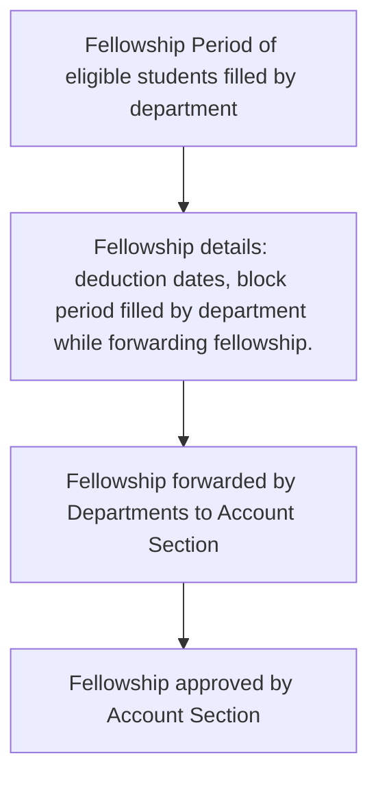

# Fellowship

!> This page is not complete and requires further modifications.

Fellowship are grants or stipend awarded to Master's and Doctorate students on a monthly basis.
Fellowship are awarded over a particular period of the student's academic years called fellowship period. 
It starts with enrolling the student into the fellowship program and ends with presentation.

The time period for which fellowship is granted is termed as **Fellowship Period.** 

There might be some time period when fellowships are not granted. This time period is called the **Fellowship Block Period**. Each student
can have different fellowship block period which can range from weeks to months.

Further, there might be some individual dates in the month for which fellowship must be deducted. These are 
called **Deduction Dates** and are filled during forwarding the fellowship.

!>Fellowship must be calculated exactly from the start date to the presentation date.

## Fellowship Timeline

## Eligibility Criteria

For a student to be eligible for fresh fellowships, the following conditions must be satisfied:

1. The student **should be pass in the previous semester** unless the current semester is the first semester.
2. The student **must have his financial details updated**.
3. The student's **fellowship period must be active and unblocked**.
4. The student **must not have got fellowship** for that particular combination of month and year.

## Fresh Fellowships

Fresh fellowship are awarded to Ph.D. and M.Tech Students each month from 21st of the month to 25th of the month.

If for some reason fellowship of a student isn't filled during this time period, it is automatically updated to 
pending fellowship.

For eg:- Fresh Fellowship for month of March will be filled between 21st and 25th March.

!> If fellowship is not filled within the fresh period, it is automatically considered as pending.

## Pending Fellowships

Pending fellowships are filled between 5th and 20th of the month for any previous month. 
This may be used to forward fellowship of a student who was either not been given any fellowship of previous month/year 
using fresh option or was not given full fellowship of any previous month/year using fresh option.

## Calculating Fellowship

Fellowship is calculated (for our benefit) on per day basis. Deduction dates are removed from the days of the
month while calculating the fellowship. HRA and other benefits are also added if required.

For Ph.D. fellowships, JRF and SRF have different amounts, so it is important to check
if current student is eligible under JRF and SRF.